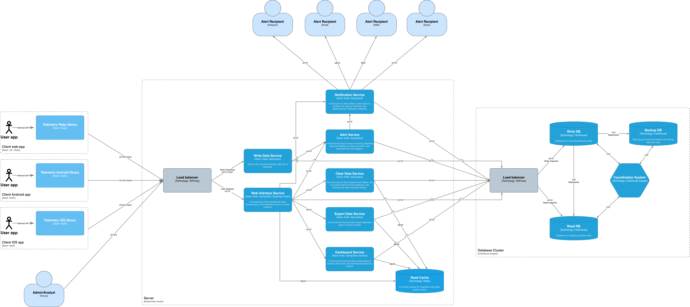

# Сервис телеметрии с алертингом для веб- и мобильных приложений

## Требования системы

### Функциональные требования
- Система должна предоставлять функционал по сбору телеметрии (метрики, логи, трейсы) с различных программных систем, включая мобильные и веб-приложения.
- Система должна быть способна собирать и агрегировать данные телеметрии с нескольких источников одновременно.
- Система должна предоставлять функционал по разделению данных на критичные и некритичные, для которых предъявляются разные требования по длительности хранения.
- Система должна предоставлять веб-интерфейс для чтения, визуализации и выгрузки данных телеметрии.
- Для наглядной визуализации числовых метрик система должна быть способна строить графики и дашборды.
- Система должна предоставлять функционал фильтрации и поиска телеметрических данных по источнику, типу, критичности, времени и другим параметрам.
- Система должна позволять экспортировать выбранные данные телеметрии в форматы CSV, JSON или Parquet для дальнейшего анализа внешними средствами.
- Система должна обладать функционалом алертинга для уведомления клиента через различные средства (Slack, SMS, Telegram, тикет в Jira и т.д.) по настраиваемым через веб-интерфейс триггерам.
- Система должна предоставлять возможность просмотра истории алертов и управления активными алертами (включение, отключение, повторное уведомление).
- Система должна предоставлять ролевую модель доступа в веб-интерфейс с двумя типами пользователей:
  1. Аналитик - имеет права только на чтение данных, просмотр дашбордов и отчётов.
  2. Администратор - имеет права на удаление данных, создание и настройку алерт-триггеров, изменение методов уведомлений и проч.
- Система должна обеспечивать авторизацию и разграничение прав в соответствии с назначенной ролью.

### Нефункциональные требования

- Система должна предоставлять набор SDK/библиотек под различные программные платформы (включая мобильные), через которые пользователи системы отправляют данные телеметрии.
- Система при работе на мобильных устройствах (и при необходимости других клиентах) должна корректно обрабатывать ситуации кратковременной потери связи. Максимальный период накопления данных должен быть настраиваемым. Потеря связи не должна приводить к утере данных телеметрии.
- Серверная часть системы должна быть кроссплатформенной и устанавливаться на популярных дистрибутивах Linux (Debian, Astra, CentOS, Fedora и др.).
- Система должна динамически масштабироваться при увеличении нагрузки.
- Система должна быть способна надёжно хранить критичные данные телеметрии длительный период времени (более 2 лет).
- Система должна быть способна хранить и обрабатывать некритичные данные телеметрии в полном объеме в течение 72 часов.
- Для оптимизации передачи данных телеметрии, они должны отправляться от клиента к серверу пачками (batch). Допускается задержка между фиксацией данных и их фактической отправкой.
- Система должна поддерживать обработку не менее 3000 запросов на запись пачки данных телеметрии в секунду.
- Среднее время отклика веб-интерфейса при обычном использовании (не при запросах выборки и агрегации данных) не должно превышать 2 секунд.
- Система должна обеспечивать защиту данных при их передаче. Все исходящие от клиента соединения должны использовать защищённый протокол (HTTPS/TLS).
- Для уменьшения сетевого трафика передаваемые данные должны сжиматься клиентской библиотекой перед отправкой и разархивироваться сервером после получения.
- Система должна иметь механизм аутентификации пользователей с использованием безопасных методов (например, JWT, OAuth 2.0).
- Система должна быть отказоустойчивой. Отказ одного узла не должен приводить к недоступности системы в целом. Компоненты должны поддерживать автоматический перезапуск.
- Система должна обеспечивать возможность резервного копирования и восстановления данных из бэкапов.
- Система должна быть расширяемой: архитектура должна предусматривать возможность добавления новых типов источников телеметрии и новых способов уведомления без модификации основной логики.
- Интерфейс пользователя должен быть интуитивно понятным и поддерживать адаптивную верстку для корректного отображения на экранах разных размеров.

### Ограничения
- Это не облачный сервис, потребитель должен разворачивать экземпляр системы на собственных вычислительных мощностях. 
- Предполагается что экземпляром системы может пользоваться и управлять только один потребитель (например компания). То есть не предполагается логического разделения данных телеметрии по потребителям системы, администратор в веб-интерфейсе видит все собранные данные.
- Система не предоставляет инструментов для детальной аналитики собранных данных телеметрии. Но имеется возможность выгрузить данные в различных форматах для последующего анализа через другие инструменты.
- Отправка данных телеметрии допускается только через предоставляемую клиентскую библиотеку. Использовать API сервера системы напрямую запрещено.
- Не гарантируется возможность чтения только что записанных данных. Задержка между отправкой данных телеметрии и возможностью их прочитать (например через веб-интерфейс) может достигать 5 минут.

### Метрики SLA, SLO и SLI для системы
#### 1. Доступность сервиса на запись данных телеметрии
  - SLA - 99.99% процентов доступности за календарный месяц.
  - SLO - ≥ 99.99% успешных запросов на запись данных телеметрии.
  - SLI - процент успешно завершённых HTTP-запросов к API приёма телеметрии по отношению к общему числу запросов за отчётный период.

#### 2. Время ответа сервиса на запись данных телеметрии
  - SLA - не менее 99% запросов на запись данных телеметрии должны быть обработаны менее чем за 5 секунд.
  - SLO - ≥ 99% запросов на запись данных телеметрии выполняются быстрее 5 сек.
  - SLI - процент HTTP-запросов на запись телеметрии, завершившихся за время не более установленного порога (5 секунд).
 
#### 3. Время доставки уведомления (алерта) с момента срабатывания триггера
  - SLA - в 99% случаев уведомления (хотя бы по одному из каналов) должны доставляться за время не более 120 секунд.
  - SLO - не менее 99% уведомлений доставляются в течение 120 секунд с момента срабатывания триггера.
  - SLI - процент уведомлений, для которых система получила подтверждение успешной доставки.

#### 4. Объем обрабатываемых данных телеметрии
- SLA - Объем записываемых данных - не менее 3000 записей в секунду данных телеметрии любого типа.
- SLO - Система должна выдерживать не менее 3000 RPS на запись независимо от типа данных.
- SLI - Количество выполненных запросов в секунду.

## Предлагаемая архитектура

Для удовлетворения требований о надежности и масштабируемости сервиса телеметрии выбрана микросервисная архитектура по следующим причинам:
1. Микросервисная архитектура позволяет выполнить требования по масштабируемости системы.
2. Микросервисы, а также их оркестрация позволяет сделать систему отказоустойчивой.
3. Микросервисная архитектура позволит сделать систему легко расширяемой, при необходимости добавления нового функционала будет создан/доработан лишь один микросервис, без влияния на остальные части системы.

Схема архитектуры системы представлена на схеме (также продублирована в макете .drawio)

### Компоненты системы с кратким описанием

#### Клиентская часть

Библиотеки для отправки телеметрии (Telemetry library на схеме) - набор библиотек под различные платформы, они подключаются и используются в системе с которой собирается телеметрия. Библиотека представляет собой обертку над API записи данных телеметрии с настраиваемым буфером данных. Буферизация нужна для двух целей:
  1. Для накопления данных телеметрии и отправкой их в сервис пачками в сжатом виде, чтобы уменьшить сетевой трафик.
  2. Для сохранения собранных данных телеметрии в периоды отсутствия связи с сервером (наиболее актуально для мобильных приложений). Для длительных периодов недоступности предусмотрена возможность записи собранных данных на диск.

#### Серверная часть

Все компоненты системы развернуты и функционируют в системе оркестрации Kubernetes, что обеспечивает высокую отказоустойчивость, масштабируемость и автоматизацию управления жизненным циклом сервисов. Каждый сервис системы может быть развернут в нескольких экземплярах (Pods) для обеспечения отказоустойчивости и высокой доступности. Kubernetes автоматически следит за состоянием каждого пода через механизмы liveness и readiness проб. Liveness проба позволяет определить, жив ли под, и при необходимости автоматически перезапустить его в случае сбоя, предотвращая зависание или некорректное функционирование сервиса. Для управления нагрузкой на систему используется функционал Horizontal Pod Autoscaler (HPA), который автоматически увеличивает или уменьшает количество экземпляров сервисов в зависимости от текущей нагрузки. Таким образом, при резком увеличении объема данных от клиентов или при росте числа активных дашбордов система может динамически масштабироваться, создавая новые поды для компенсации нагрузки. При снижении нагрузки Kubernetes автоматически уменьшает количество подов, оптимизируя потребление ресурсов.

В качестве стека для бэкенд части была выбрана Java-платформа, в частности язык программирования Kotlin из-за развитой экосистемы Java-платформы, ее производительности, удобству разработки, а также большому количеству кадров на рынке труда, владеющих этим стеком. В качестве серверного фреймворка планируется использование Spring Boot, так как он обеспечивает удобную инфраструктуру для построения REST API, интеграции с базами данных, системами кэширования, балансировщиками и брокерами сообщений.

В качестве стека для фронтенд части используется язык программирования TypeScript в связке с фреймфорком React по причине высокой производительности, легкости в поддержке, а также популярности и распространенности этих решений. Кроме того, благодаря наличию большого количества готовых библиотек и UI-компонентов (например, Recharts, Material UI, Ant Design, ShadCN и др.), разработка визуальных элементов, таких как графики, таблицы, фильтры и панели алертинга, становится значительно проще и быстрее. Для отрисовки дашбордов метрик планируется использование инструмента Grafana.

Компоненты серверной части:

- Балансировщик нагрузки (Load Balancer на схеме) - экземпляр HAProxy отслеживает состояние каждого пода с помощью встроенных механизмов мониторинга, включая health checks и метрики производительности, что позволяет своевременно выявлять недоступные или перегруженные поды и исключать их из пула для распределения нагрузки. Таким образом обеспечивается стабильность и непрерывность работы всей системы даже при возникновении отказов отдельных компонентов. Когда новые поды создаются автоматически системой оркестрации или через механизмы Horizontal Pod Autoscaler, HAProxy автоматически добавляет их в пул балансировки. Аналогично, при удалении подов или их временной недоступности балансировщик исключает их из распределения трафика, что обеспечивает их непрерывную доступность. Также HAProxy позволяет реализовать шаблон проектирования API Gateway, где он выполняет роль единой точки входа в сервер, на которой возможно выполнять маршрутизацию трафика.

- Сервис кэширования (Read Cache на схеме) - экземпляр Redis, предназначенный для кэширования и быстрого доступа на чтение к часто используемым данным. Ожидается что кэш будет эффективен в сценариях повторяющихся выборок и выгрузок данных, например когда аналитик во время настройки дашборда по метрикам неоднократно запрашивает одни и те же данные. Поэтому применяется стратегия кэширования First In First Out, то есть недавно прочитанные данные постепенно вытесняют из кэша данные, которые давно не запрашивались. Важно добавить что в кэш добавляются только те данные, которые были запрошены на чтение, при записи данных телеметрии через Сервис записи данных, взаимодействия с Redis не происходит.

- Сервис записи данных (Write Data Service на схеме) - микросервис, предоставляющий API записи данных телеметрии для клиентских библиотек. После получения запроса на добавление пачки данных телеметрии разархивирует данные и отправляет запрос на запись в базу данных (batch insert). Также отправляет полученные данные телеметрии в Cервис алертинга (Alert Service).
  
  API:
  1. HTTP POST /telemetry

- Сервис алертинга (Alert Service на схеме) - микросервис, ответственный за просмотр, создание, редактирование и удаление триггеров алертинга (уведомлений клиента). Также этот сервис предоставляет API для получения новых данных телеметрии. После получения и разархивирования данные анализируются на применимость к ним существущих триггеров алертинга. В случае срабатывания триггера вызывается Сервис уведомлений (Notification Service) для оповещения клиента. Таким образом, из-за того что проверка данных телеметрии производится непосредственно после их получения (а не вычитыванием из БД уже записанных данных), обеспечивается максимально быстрая реакция на нештатные показатели телеметрии. Срабатывание триггера также записывается в журнал в БД. Сервис предоставляет эндпоинт для получения и удаления данных журнала срабатываний триггеров.
    
  API:
  1. HTTP GET, POST, PUT, DELETE /trigger
  1. HTTP GET, DELETE /trigger/journal
  3. HTTP POST /telemetry

- Сервис уведомлений (Notification Service на схеме) - микросервис, который предоставляет функционал по просмотру, созданию, редактированию и удалению методов уведомления клиента о наступлении определенной им ситуации. Также предоставляет API для инициации процесса отправки уведомлений клиенту, после которой происходит информирование ответственных лиц по настроенным каналам (это может быть SMS-сообщение, уведомление в Telegram, Slack, письмо в электронной почте, тикет в Jira и др).

  API:
  1. HTTP POST /notification - эндроинт для инициации процедуры уведомления клиента
  2. HTTP GET, POST, PUT, DELETE /notification/telegram
  3. HTTP GET, POST, PUT, DELETE /notification/slack
  4. HTTP GET, POST, PUT, DELETE /notification/email
  5. HTTP GET, POST, PUT, DELETE /notification/sms
  6. HTTP GET, POST, PUT, DELETE /notification/jira

- Сервис веб-интерфейса (Web Interface Service на схеме) - сервис, предоставляющий пользовательский веб-интерфейс для администрирования параметров и настроек алертинга, уведомлений, а также просмотра и удаления данных телеметрии. Через API взаимодействует с Сервисом алертинга, Сервисом уведомлений, Сервисом экспорта данных, Сервисом дашбордов и Сервисом очистки данных для предоставления функционала этих сервисов. Также для ускорения чтения данных телеметрии и снижении нагрузки на БД чтения используется кэш Redis. То есть при запросе данных телеметрии сначала выполняется попытка найти искомые данные в кэше и только в случае если в кэше данных не оказалось, производится запрос в БД чтения (и затем запись в кэш).

- Сервис экспорта данных (Export Data Service на схеме) - микросервис, ответственный за экспорт данных телеметрии в различных форматах (CSV, JSON, Parquet). После получения запроса на экспорт данных выполняется попытка найти искомые данные в кэше, в случае если в кэше данных не оказалось, производится запрос в БД чтения (и последующая запись их в кэш). После получения данных сервис конвертирует их в требуемый формат и возвращает в виде файла.

  API:
  1. HTTP GET /export/json
  2. HTTP GET /export/csv
  3. HTTP GET /export/parquet

- Сервис дашбордов (Dashboard Service на схеме) - микросервис с помощью которого происходит создание, просмотр, настройка и редактирование дашбордов метрик. Для визуализации дашбордов и метрик используется инструмент Grafana. При просмотре метрик через дашборд для ускорения чтения данных сначала выполняется попытка найти искомые данные в кэше Redis и только в случае если в кэше данных не оказалось, производится запрос в БД чтения (и затем запись в кэш).

  API:
  1. HTTP GET /dashboards
  2. HTTP GET, POST, PUT, DELETE /dashboard/{id}

- Сервис очистки данных (Clear Data Service на схеме) - микросервис, ответственный за очистку старых данных телеметрии из БД. Критичные и некритичные данные очищаются с разной (настраиваемой администратором) периодичностью. Ожидаемый паттерн использования - логи уровня error, связанные с ними трейсы и метрики обозначать критичными, все остальное - некритичные данные. После очистки данных в БД сервис также зачищает их в кэше Redis. Также предоставляет API для просмотра и редактирования параметров данных телеметрии, которые подлежат очистке (например какое время нужно хранить логи).

  API:
  1. HTTP GET, POST, PUT, DELETE /storage/parameters

#### Базы данных

Исходя из особенностей системы телеметрии, функциональных и нефункциональных требований, в части хранения данных можно выделить следующие вводные:
1. Большую часть хранимой информации будут составлять получаемые из клиентских приложений данные телеметрии трех типов: метрики, логи и трейсы. Для логов и трейсов таблицы будут содержать относительно небольшое количество колонок (не более 10), но при этом их значения могут быть довольно крупными (особенно для логов). Таблицы с метриками могут иметь произвольное количество колонок (зависит от отправляемого клиентом состава метрик), но с компактными значениями в них.
2. Меньшую часть хранимой информации будут составлять системные таблицы, содержащие информацию о настройках дашбордов, триггеров алертинга и проч.
3. Предполагается большая постоянная нагрузка на запись данных телеметрии.
4. Поток запросов на чтение данных телеметрии в целом ожидается небольшой, т.к. чтение выполняется только по запросу администраторов/аналитиков через веб-интерфейс, но возможны всплески нагрузки при активной аналитической работе.
5. Для надежного хранения данных и выполнения требований по отказоустойчивости требуется постоянно реплицировать и бэкапить данные.
6. Выполнение требований ACID не требуется.

Отталкиваясь от этих вводных, в качестве хранилища данных выбрана СУБД **ClickHouse** по следующим причинам:
1. Из-за специфики данных телеметрии в них нет каких-либо жестких связей между собой, также не требуются сложные транзакции, что позволяет использовать NoSQL базу данных (которой и является ClickHouse), обеспечивающую большую производительность и гибкость.
2. ClickHouse - аналитическая СУБД, специально оптимизированная для скоростной вставки больших потоков данных пачками по модели append-only, эффективных выборок по диапазонам времени и высокой компрессии и низкой стоимости хранения. Все это отлично подходит для сервиса телеметрии.
3. В сценариях работы сервиса не предполагается редактирования данных телеметрии (производительность update операций в ClickHouse невысокая).
4. ClickHouse поддерживает репликацию и шардирование через интеграцию с ZooKeeper (ClickHouse Keeper).
5. ClickHouse поддерживает возможность партицирования по времени, что будет полезно при очистке старых данных телеметрии.

Организация кластера баз данных выполнена по шаблону CQRS, то есть запросы на чтение и запись распределяются по разным экземплярам БД ClickHouse. Это позволяет распределить нагрузку между несколькими экземплярами БД, а также оптимизировать и ускорить операции чтения и записи (например в БД чтения использовать индексы, а в БД записи не использовать).

Компоненты кластера БД:

- Балансировщик нагрузки (Load Balancer на схеме) - экземпляр HAProxy отслеживает состояние экземпляров БД и равномерно распределяет нагрузку между ними.

- База данных записи (Write DB на схеме) - экземпляр ClickHouse предназначенный для записи в него данных и оптимизированный под эту задачу. Является мастер-источником данных, из которого происходит репликация в Базы данных чтения и Базы данных резервного копирования.

- База данных чтения (Read DB на схеме) - экземпляр ClickHouse предназначенный для чтения данных и оптимизированный под эту задачу. При необходимости может быть развернут более чем в одном экземпляре.

- База данных резервного копирования (Backup DB на схеме) - георезервированный экземпляр ClickHouse предназначенный для резервного сохранения данных телеметрии. При необходимости может быть развернут более чем в одном экземпляре

- Координатор кластера БД (Coordination System на схеме) - сервис ClickHouse Keeper, который осуществляет координацию компонентов кластера ClickHouse и выполняет репликацию данных из Базы данных записи в Базы данных чтения и Базы данных резервного копирования.