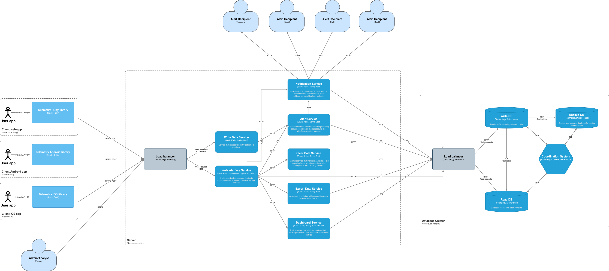
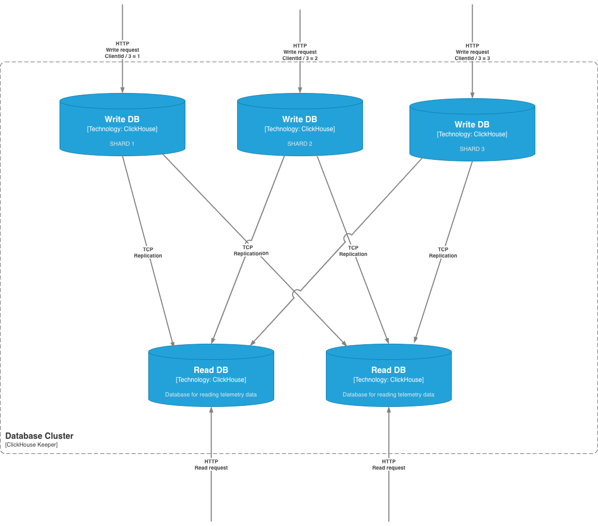
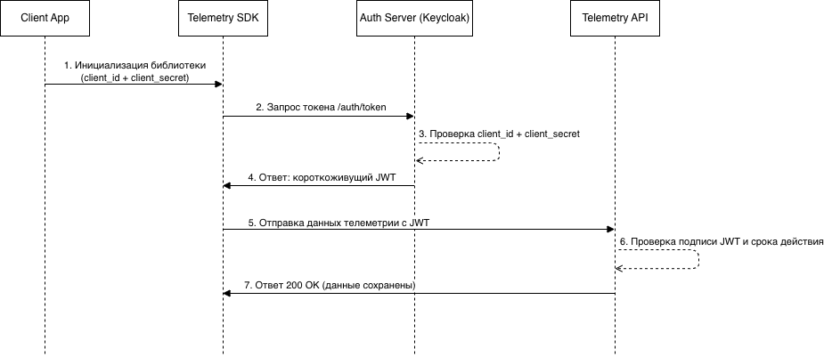

# Сервис телеметрии с алертингом для веб- и мобильных приложений

## Требования системы

### Функциональные требования
- Система должна предоставлять функционал по сбору телеметрии (метрики, логи, трейсы) с различных программных систем, включая мобильные и веб-приложения.
- Система должна быть способна собирать и агрегировать данные телеметрии с нескольких источников одновременно.
- Система должна предоставлять функционал по разделению данных на критичные и некритичные, для которых предъявляются разные требования по длительности хранения.
- Система должна предоставлять веб-интерфейс для чтения, визуализации и выгрузки данных телеметрии.
- Для наглядной визуализации числовых метрик система должна быть способна строить графики и дашборды.
- Система должна предоставлять функционал фильтрации и поиска телеметрических данных по источнику, типу, критичности, времени и другим параметрам.
- Система должна позволять экспортировать выбранные данные телеметрии в форматы CSV, JSON или Parquet для дальнейшего анализа внешними средствами.
- Система должна обладать функционалом алертинга для уведомления клиента через различные средства (Slack, SMS, Telegram, тикет в Jira и т.д.) по настраиваемым через веб-интерфейс триггерам.
- Система должна предоставлять возможность просмотра истории алертов и управления активными алертами (включение, отключение, повторное уведомление).
- Система должна предоставлять ролевую модель доступа в веб-интерфейс с двумя типами пользователей:
  1. Аналитик - имеет права только на чтение данных, просмотр дашбордов и отчётов.
  2. Администратор - имеет права на удаление данных, создание и настройку алерт-триггеров, изменение методов уведомлений и проч.
- Система должна обеспечивать авторизацию и разграничение прав в соответствии с назначенной ролью.

### Нефункциональные требования

- Система должна предоставлять набор SDK/библиотек под различные программные платформы (включая мобильные), через которые пользователи системы отправляют данные телеметрии.
- Система при работе на мобильных устройствах (и при необходимости других клиентах) должна корректно обрабатывать ситуации кратковременной потери связи. Максимальный период накопления данных должен быть настраиваемым. Потеря связи не должна приводить к утере данных телеметрии.
- Серверная часть системы должна быть кроссплатформенной и устанавливаться на популярных дистрибутивах Linux (Debian, Astra, CentOS, Fedora и др.).
- Система должна динамически масштабироваться при увеличении нагрузки.
- Система должна быть способна надёжно хранить критичные данные телеметрии длительный период времени (более 2 лет).
- Система должна быть способна хранить и обрабатывать некритичные данные телеметрии в полном объеме в течение 72 часов.
- Для оптимизации передачи данных телеметрии, они должны отправляться от клиента к серверу пачками (batch). Допускается задержка между фиксацией данных и их фактической отправкой.
- Система должна поддерживать обработку не менее 3000 запросов на запись пачки данных телеметрии в секунду.
- Среднее время отклика веб-интерфейса при обычном использовании (не при запросах выборки и агрегации данных) не должно превышать 2 секунд.
- Система должна обеспечивать защиту данных при их передаче. Все исходящие от клиента соединения должны использовать защищённый протокол (HTTPS/TLS).
- Для уменьшения сетевого трафика передаваемые данные должны сжиматься клиентской библиотекой перед отправкой и разархивироваться сервером после получения.
- Система должна иметь механизм аутентификации пользователей с использованием безопасных методов (например, JWT, OAuth 2.0).
- Система должна быть отказоустойчивой. Отказ одного узла не должен приводить к недоступности системы в целом. Компоненты должны поддерживать автоматический перезапуск.
- Система должна обеспечивать возможность резервного копирования и восстановления данных из бэкапов.
- Система должна быть расширяемой: архитектура должна предусматривать возможность добавления новых типов источников телеметрии и новых способов уведомления без модификации основной логики.
- Интерфейс пользователя должен быть интуитивно понятным и поддерживать адаптивную верстку для корректного отображения на экранах разных размеров.

### Ограничения
- Это не облачный сервис, потребитель должен разворачивать экземпляр системы на собственных вычислительных мощностях.
- Предполагается что экземпляром системы может пользоваться и управлять только один потребитель (например компания). То есть не предполагается логического разделения данных телеметрии по потребителям системы, администратор в веб-интерфейсе видит все собранные данные.
- Система не предоставляет инструментов для детальной аналитики собранных данных телеметрии. Но имеется возможность выгрузить данные в различных форматах для последующего анализа через другие инструменты.
- Отправка данных телеметрии допускается только через предоставляемую клиентскую библиотеку. Использовать API сервера системы напрямую запрещено.
- Не гарантируется возможность чтения только что записанных данных. Задержка между отправкой данных телеметрии и возможностью их прочитать (например через веб-интерфейс) может достигать 5 минут.

### Метрики SLA, SLO и SLI для системы
#### 1. Доступность сервиса на запись данных телеметрии
- SLA - 99.99% процентов доступности за календарный месяц.
- SLO - ≥ 99.99% успешных запросов на запись данных телеметрии.
- SLI - процент успешно завершённых HTTP-запросов к API приёма телеметрии по отношению к общему числу запросов за отчётный период.

#### 2. Время ответа сервиса на запись данных телеметрии
- SLA - не менее 99% запросов на запись данных телеметрии должны быть обработаны менее чем за 5 секунд.
- SLO - ≥ 99% запросов на запись данных телеметрии выполняются быстрее 5 сек.
- SLI - процент HTTP-запросов на запись телеметрии, завершившихся за время не более установленного порога (5 секунд).

#### 3. Время доставки уведомления (алерта) с момента срабатывания триггера
- SLA - в 99% случаев уведомления (хотя бы по одному из каналов) должны доставляться за время не более 120 секунд.
- SLO - не менее 99% уведомлений доставляются в течение 120 секунд с момента срабатывания триггера.
- SLI - процент уведомлений, для которых система получила подтверждение успешной доставки.

#### 4. Объем обрабатываемых данных телеметрии
- SLA - Объем записываемых данных - не менее 3000 записей в секунду данных телеметрии любого типа.
- SLO - Система должна выдерживать не менее 3000 RPS на запись независимо от типа данных.
- SLI - Количество выполненных запросов в секунду.

## Предлагаемая архитектура

Для удовлетворения требований о надежности и масштабируемости сервиса телеметрии выбрана микросервисная архитектура по следующим причинам:
1. Микросервисная архитектура позволяет выполнить требования по масштабируемости системы.
2. Микросервисы, а также их оркестрация позволяет сделать систему отказоустойчивой.
3. Микросервисная архитектура позволит сделать систему легко расширяемой, при необходимости добавления нового функционала будет создан/доработан лишь один микросервис, без влияния на остальные части системы.

Схема архитектуры системы представлена на схеме (также продублирована в макете .drawio)



### Компоненты системы с кратким описанием

#### Клиентская часть

Библиотеки для отправки телеметрии (Telemetry library на схеме) - набор библиотек под различные платформы, они подключаются и используются в системе с которой собирается телеметрия. Библиотека представляет собой обертку над API записи данных телеметрии с настраиваемым буфером данных. Буферизация нужна для двух целей:
1. Для накопления данных телеметрии и отправкой их в сервис пачками в сжатом виде, чтобы уменьшить сетевой трафик.
2. Для сохранения собранных данных телеметрии в периоды отсутствия связи с сервером (наиболее актуально для мобильных приложений). Для длительных периодов недоступности предусмотрена возможность записи собранных данных на диск.
   В случае получения ошибки при отправке запроса на сохранение данных телеметрии (или если ответ вообще не получен) клиентская библиотека периодически осуществляет повторные попытки отправки данных. Данные из буфера очищаются только после их успешной отправки в сервис, либо по достижении максимального размера буфера.


#### Серверная часть

Все компоненты системы развернуты и функционируют в системе оркестрации Kubernetes, что обеспечивает высокую отказоустойчивость, масштабируемость и автоматизацию управления жизненным циклом сервисов. Каждый сервис системы может быть развернут в нескольких экземплярах (Pods) для обеспечения отказоустойчивости и высокой доступности. Kubernetes автоматически следит за состоянием каждого пода через механизмы liveness и readiness проб. Liveness проба позволяет определить, жив ли под, и при необходимости автоматически перезапустить его в случае сбоя, предотвращая зависание или некорректное функционирование сервиса. Для управления нагрузкой на систему используется функционал Horizontal Pod Autoscaler (HPA), который автоматически увеличивает или уменьшает количество экземпляров сервисов в зависимости от текущей нагрузки. Таким образом, при резком увеличении объема данных от клиентов или при росте числа активных дашбордов система может динамически масштабироваться, создавая новые поды для компенсации нагрузки. При снижении нагрузки Kubernetes автоматически уменьшает количество подов, оптимизируя потребление ресурсов.

В качестве стека для бэкенд части была выбрана Java-платформа, в частности язык программирования Kotlin из-за развитой экосистемы Java-платформы, ее производительности, удобству разработки, а также большому количеству кадров на рынке труда, владеющих этим стеком. В качестве серверного фреймворка планируется использование Spring Boot, так как он обеспечивает удобную инфраструктуру для построения REST API, интеграции с базами данных, системами кэширования, балансировщиками и брокерами сообщений.

В качестве стека для фронтенд части используется язык программирования TypeScript в связке с фреймфорком React по причине высокой производительности, легкости в поддержке, а также популярности и распространенности этих решений. Кроме того, благодаря наличию большого количества готовых библиотек и UI-компонентов (например, Recharts, Material UI, Ant Design, ShadCN и др.), разработка визуальных элементов, таких как графики, таблицы, фильтры и панели алертинга, становится значительно проще и быстрее. Для отрисовки дашбордов метрик планируется использование инструмента Grafana.

Компоненты серверной части:

- Балансировщик нагрузки (Load Balancer на схеме) - экземпляр HAProxy отслеживает состояние каждого пода с помощью встроенных механизмов мониторинга, включая health checks и метрики производительности, что позволяет своевременно выявлять недоступные или перегруженные поды и исключать их из пула для распределения нагрузки. Таким образом обеспечивается стабильность и непрерывность работы всей системы даже при возникновении отказов отдельных компонентов. Когда новые поды создаются автоматически системой оркестрации или через механизмы Horizontal Pod Autoscaler, HAProxy автоматически добавляет их в пул балансировки. Аналогично, при удалении или временной недоступности подов балансировщик исключает их из распределения трафика, что обеспечивает их непрерывную доступность.


- Сервис записи данных (Write Data Service на схеме) - микросервис, предоставляющий API записи данных телеметрии для клиентских библиотек. После получения запроса на добавление пачки данных телеметрии разархивирует данные и отправляет запрос на запись в базу данных (batch insert). Процесс приеме запроса и записи в БД синхронный, то есть сервис возвращает клиентской библиотеке ответ на запрос только после успешной записи в БД. Также отправляет полученные данные телеметрии в Cервис алертинга (Alert Service).

  API:
  1. HTTP POST /telemetry


- Сервис алертинга (Alert Service на схеме) - микросервис, ответственный за просмотр, создание, редактирование и удаление триггеров алертинга (уведомлений клиента). Также этот сервис предоставляет API для получения новых данных телеметрии. После получения и разархивирования данные анализируются на применимость к ним существущих триггеров алертинга. В случае срабатывания триггера вызывается Сервис уведомлений (Notification Service) для оповещения клиента. Таким образом, из-за того что проверка данных телеметрии производится непосредственно после их получения (а не вычитыванием из БД уже записанных данных), обеспечивается максимально быстрая реакция на нештатные показатели телеметрии. Срабатывание триггера также записывается в журнал в БД. Сервис предоставляет эндпоинт для получения и удаления данных журнала срабатываний триггеров.

  API:
  1. HTTP GET, POST, PUT, DELETE /trigger
  2. HTTP GET, DELETE /trigger/journal
  3. HTTP PUT /telemetry


- Сервис уведомлений (Notification Service на схеме) - микросервис, который предоставляет функционал по просмотру, созданию, редактированию и удалению методов уведомления клиента о наступлении определенной им ситуации. Также предоставляет API для инициации процесса отправки уведомлений клиенту, после которой происходит информирование ответственных лиц по настроенным каналам (это может быть SMS-сообщение, уведомление в Telegram, Slack, письмо в электронной почте, тикет в Jira и др).

  API:
  1. HTTP POST /notification - эндроинт для инициации процедуры уведомления клиента
  2. HTTP GET, POST, PUT, DELETE /notification/telegram
  3. HTTP GET, POST, PUT, DELETE /notification/slack
  4. HTTP GET, POST, PUT, DELETE /notification/email
  5. HTTP GET, POST, PUT, DELETE /notification/sms
  6. HTTP GET, POST, PUT, DELETE /notification/jira


- Сервис веб-интерфейса (Web Interface Service на схеме) - сервис, предоставляющий пользовательский веб-интерфейс для администрирования параметров и настроек алертинга, уведомлений, а также просмотра и удаления данных телеметрии. По своей сути является витриной для доступа к функционалу который предоставляют другие микросервисы. Через API взаимодействует с Сервисом алертинга, Сервисом уведомлений, Сервисом экспорта данных, Сервисом дашбордов и Сервисом очистки данных для предоставления функционала этих сервисов.


- Сервис экспорта данных (Export Data Service на схеме) - микросервис, ответственный за экспорт данных телеметрии в различных форматах (CSV, JSON, Parquet). После получения запроса на экспорт данных выполняется попытка найти искомые данные в кэше, в случае если в кэше данных не оказалось, производится запрос в БД чтения (и последующая запись их в кэш). После получения данных сервис конвертирует их в требуемый формат и возвращает в виде файла.

  API:
  1. HTTP GET /export/json
  2. HTTP GET /export/csv
  3. HTTP GET /export/parquet


- Сервис дашбордов (Dashboard Service на схеме) - микросервис с помощью которого происходит создание, просмотр, настройка и редактирование дашбордов метрик. Для визуализации дашбордов и метрик используется инструмент Grafana.

  API:
  1. HTTP GET /dashboards
  2. HTTP GET, POST, PUT, DELETE /dashboard/{id}


- Сервис очистки данных (Clear Data Service на схеме) - микросервис, ответственный за очистку старых данных телеметрии из БД. Критичные и некритичные данные очищаются с разной (настраиваемой администратором) периодичностью. Ожидаемый паттерн использования - логи уровня error, связанные с ними трейсы и метрики обозначать критичными, все остальное - некритичные данные. Также предоставляет API для просмотра и редактирования параметров данных телеметрии, которые подлежат очистке (например какое время нужно хранить логи).

  API:
  1. HTTP GET, POST, PUT, DELETE /storage/parameters


#### Базы данных

Исходя из особенностей системы телеметрии, функциональных и нефункциональных требований, в части хранения данных можно выделить следующие вводные:
1. Большую часть хранимой информации будут составлять получаемые из клиентских приложений данные телеметрии трех типов: метрики, логи и трейсы. Для логов и трейсов таблицы будут содержать относительно небольшое количество колонок (не более 10), но при этом их значения могут быть довольно крупными (особенно для логов). Таблицы с метриками могут иметь произвольное количество колонок (зависит от отправляемого клиентом состава метрик), но с компактными значениями в них.
2. Меньшую часть хранимой информации будут составлять системные таблицы, содержащие информацию о настройках дашбордов, триггеров алертинга и проч.
3. Предполагается большая постоянная нагрузка на запись данных телеметрии.
4. Поток запросов на чтение данных телеметрии в целом ожидается небольшой, т.к. чтение выполняется только по запросу администраторов/аналитиков через веб-интерфейс, но возможны всплески нагрузки при активной аналитической работе.
5. Для надежного хранения данных и выполнения требований по отказоустойчивости требуется постоянно реплицировать и бэкапить данные.
6. Выполнение требований ACID не требуется.

Отталкиваясь от этих вводных, в качестве единого хранилища данных выбрана СУБД **ClickHouse** по следующим причинам:
1. Из-за специфики данных телеметрии в них нет каких-либо жестких связей между собой, также не требуются сложные транзакции, что позволяет использовать NoSQL базу данных (которой и является ClickHouse), обеспечивающую большую производительность и гибкость.
2. ClickHouse - аналитическая СУБД, специально оптимизированная для скоростной вставки больших потоков данных пачками по модели append-only, эффективных выборок по диапазонам времени и высокой компрессии и низкой стоимости хранения. Все это отлично подходит для сервиса телеметрии.
3. В сценариях работы сервиса не предполагается редактирования данных телеметрии (производительность update операций в ClickHouse невысокая).
4. ClickHouse поддерживает репликацию и шардирование через интеграцию с ZooKeeper (ClickHouse Keeper).
5. ClickHouse поддерживает возможность партицирования по времени, что будет полезно при очистке старых данных телеметрии.

Организация кластера баз данных выполнена по шаблону CQRS, то есть запросы на чтение и запись распределяются по разным экземплярам БД ClickHouse. Это позволяет распределить нагрузку между несколькими экземплярами БД, а также оптимизировать и ускорить операции чтения и записи (например в БД чтения использовать индексы, а в БД записи не использовать).

Компоненты кластера БД:

- Балансировщик нагрузки (Load Balancer на схеме) - экземпляр HAProxy отслеживает состояние экземпляров БД и равномерно распределяет нагрузку между ними.


- База данных записи (Write DB на схеме) - экземпляр ClickHouse предназначенный для записи в него данных и оптимизированный под эту задачу. Является мастер-источником данных, из которого происходит репликация в Базы данных чтения и Базы данных резервного копирования.


- База данных чтения (Read DB на схеме) - экземпляр ClickHouse предназначенный для чтения данных и оптимизированный под эту задачу. При необходимости может быть развернут более чем в одном экземпляре.


- База данных резервного копирования (Backup DB на схеме) - георезервированный экземпляр ClickHouse предназначенный для резервного сохранения данных телеметрии. При необходимости может быть развернут более чем в одном экземпляре


- Координатор кластера БД (Coordination System на схеме) - сервис ClickHouse Keeper, который осуществляет координацию компонентов кластера ClickHouse и выполняет репликацию данных из Базы данных записи в Базы данных чтения и Базы данных резервного копирования. Для обеспечения отказоустойчивости разворачивается в виде нескольких узлов.


## Масштабируемость

При необходимости (например увеличении или уменьшении нагрузки) система должна динамически масштабироваться. Выбран вариант **горизонтального** масштабирования по следующим причинам:
1. Горизонтальное масштабирование позволяет выполнить требования к отказоустойчивости системы т.к. при сбое одного из микросервисов нагрузка автоматически распределятся между остальными. Вертикальное масштабирование не позволяет выполнить это требование так как создается единая точка отказа.
2. Горизонтальное масштабирование позволяет быстро динамически масштабировать систему, добавляя или удаляя экземпляры микросервисов. При вертикальном масштабировании эта процедура более проблематична.
3. Горизонтальное масштабирование гораздо лучше подходит под микросервисную архитектуру системы, где каждый сервис изолирован, независим и может масштабироваться автономно.

Если рассматривать проектируемую систему телеметрии с точки зрения соответствия CAP теореме, то система обеспечивает выполнение условий P (Partition tolerance) и A (Availability), жертвуя условием C (Consistency). Микросервисная архитектура системы прямо предполагает подход с разделением узлов (P), а предпочтение доступности (А) в ущерб консистентности (P) следует из требований к системе про 99,99% успешных запросов на запись телеметрии и ограничений, которые говорят о том что допускается задержка между записью данных и возможностью их чтения.

Масштабирование системы на уровне приложений обеспечивается механизмом Kubernetes Horizontal Pod Autoscaler (HPA), который описан выше.

Масштабирование системы на уровне баз данных реализуется через шардирование и репликации данных между экземплярами баз данных. Шардирование (разделение данных на сегменты - шарды) позволяет распределять общий объём данных между несколькими физическими экземплярами баз данных. Каждый шард хранит только часть общего набора данных (паттерн Active-Active by Shard).
Это даёт следующие преимущества:
* Равномерное распределение нагрузки на запись между несколькими узлами.
* Возможность горизонтального масштабирования при увеличении объёма данных.
* Ускорение выполнения запросов за счёт параллельной обработки данных разными нодами.

Ключом шардирования может выступать идентификатор клиентского приложения с которого собираются данные телеметрии. Таким образом данные распределяются по разным экземплярам БД записи, откуда реплицируются во все БД чтения. При необходимости масштабировать БД записи данных, в кластер добавляется новый экземпляр ClickHouse и меняется формула распределения данных по шардам таким образом, чтобы часть данных попадала в новый экземпляр БД. Схема взаимодействия экземпляров БД ClickHouse при шардировании показана на схеме scaling:



## Обеспечение высокой доступности и отказоустойчивости

Для обеспечения максимальной отказоустойчивости доступен вариант развертывания системы в составе двух и более геораспределенных Kubernetes кластеров. В случае полной неработоспособности одного Kubernetes кластера другой сможет обеспечить функционирование системы телеметрии (отражено на схеме monitoring ниже).

Координатор БД ClickHouse Keeper разворачивается в виде кластера из трех узлов, которые выбирают лидера и образуют кворум. Три узла обеспечивают оптимальный баланс между надежностью и накладными расходами и позволяют сохранить функциональность при отказе одного узла.

#### Сценарии отказов компонентов систем и компенсирующие механизмы

* Отказ микросервиса - Kubernetes при недоступности микросервиса автоматически перезапустит его под. Во время недостувности пода нагрузка автоматически перераспределяется на другие экземпляры этого микросервиса. Критически важные микросервисы, такие как например Сервис записи данных, Сервис алертинга и Сервис уведомлений всегда функционируют в количестве 2 и более экземпляров.
* Отказ кластера Kubernetes - при получении информации о неработоспособности кластера Kubernetes (через метрики) балансировщик нагрузки автоматически перенаправляет все входящие запросы на другой работающий кластер.
* Отказ экземпляра БД записи - данные предназначенные для отказавшей шарды записываются в другие экземпляры БД записи и из них реплицируются в БД чтения.
* Отказ экземпляра БД чтения - запросы на чтение данных отправляются в другую функционирующую БД чтения. После восстановления упавшего экземпляра перед вводом его в полноценную работу производится репликация в него недостающих данных накопившихся за время недоступности.
* Отказ экземпляра системы координации ClickHouse Keeper - два оставшихся узла продолжат работу до восстановления упавшего экземпляра.


## Оптимизация производительности

Ниже перечисленны потенциальные узкие места системы телеметрии и примененные методы оптимизации для их нивелирования.

Долгое чтение и долгая запись в базу данных:
* Базы данных разделены на отдельные экземпляры предназначенные только для чтения и другие, предназначенные только для записи (CQRS). Базы данных предназначенные для чтения сконфигурированы для ускорения чтения, они содержат оптимальные индексы на данных. БД записи наоборот не содержат индексов которые бы замедлили операции вставки данных.
* Дублирование баз данных на чтение и запись (через шардирование данных) позволяет распределить нагрузку между несколькими экземплярами БД.

Чрезмерное количество HTTP запросов на отправку телеметрии от клиентских библиотек на API Сервиса записи данных:
* Клиентскими библиотеками производится отправка данных пачками в сжатом виде.
* Kubernetes способен динамически управлять количеством микросервисов и автоматически создавать новые в случае необходимости.

API Gateway (Traefik) может стать узким местом при большом объеме входящих запросов:
* Используется возможность горизонтального масштабирования внешних шлюзов - можно развернуть несколько экземпляров Traefik.
* Включено отслеживание состояния подов (health checks), что позволяет автоматически исключать неработающие узлы из балансировки и предотвращать перегрузку отдельных инстансов.


## План мониторинга системы

Несмотря на то что можно было бы использовать проектируемую систему телеметрии для сбора информации о самой себе (это бы значительно упростило процесс сбора метрик, логов и проч.), такой подход является рискованным. При каких-либо сбоях система может не зафиксировать собственное состояние, что сделает диагностику и анализ проблем невозможным. Поэтому мониторинг компонентов системы выполняется через отдельные каналы, не связанные с работой системы телеметрии.

Для обеспечения наблюдаемости и оперативного реагирования на инциденты в системе телеметрии реализуется отдельный контур мониторинга, независимый от самой системы.
Мониторинг охватывает как прикладные микросервисы, так и инфраструктурные компоненты (API Gateway, базы данных, Kubernetes). Мониторинг и профилирование осуществляются через инструменты Prometheus для сбора данных и Grafana для их визуализации. Для возможности работы с несколькими кластерами Kubernetes, а также для большей отказоустойчивости (чтобы при отказе кластера Kubernetes не упал и сервис, который собирал с него данные) контур мониторинга расположен на отдельном сервере. Схема мониторинга системы представлена на схеме monitoring:


Метрики микросервисов (уровень приложений)

| Группа метрик       | Используемые метрики                                                           | Интерпретация                                                                                                                                     |
|---------------------|--------------------------------------------------------------------------------|---------------------------------------------------------------------------------------------------------------------------------------------------|
| HTTP-запросы        | Количество запросов, количество успешных/ошибочных кодов ответов, время ответа | Позволяют определить стабильность работы сервисов и соответствие SLO по доступности и времени ответа                                              |
| Память и CPU        | Утилизация CPU и оперативной памяти пода                                       | Резкий рост памяти или CPU может указывать на перегруженность пода и сигнализирует о том что нужно перераспределять нагрузку на другие экземпляры |
| JVM метрики         | Параметры работы JVM                                                           | Позволяет отслеживать данные виртуальной машины Java для анализа аномалий в ее работе, например утечек памяти                                     |
| Ошибки и исключения | Количество исключений, таймаутов, ошибок бизнес-логики                         | Рост числа ошибок сигнализирует о сбоях в логике приложения или внешних зависимостях                                                              |

Метрики инфраструктуры Kubernetes

| Группа метрик   | Используемые метрики                                                                                  | Интерпретация                                                |
|-----------------|-------------------------------------------------------------------------------------------------------|--------------------------------------------------------------|
| Состояние подов | Падения readiness/liveness проб, количество подов в состоянии CrashLoopBackOff, Pending, RestartCount | Позволяет оценить стабильность сервисов                      |
| Автоскейлинг    | Количество активных реплик сервисов                                                                   | Позволяет убедиться, что HPA корректно реагирует на нагрузку |

Метрики баз данных

| Группа метрик | Используемые метрики                | Интерпретация                                                                                               |
|---------------|-------------------------------------|-------------------------------------------------------------------------------------------------------------|
| Запись        | insert_rate, failed_inserts         | Отражает способность экземпляра БД обрабатывать поток телеметрии                                            |
| Чтение        | query_time_avg, select_rate         | Позволяет оценить производительность запросов на чтение данных                                              |
| Хранилище     | disk_usage, part_count, replica_lag | Рост количества партиций или задержки репликации может указывать на проблемы с хранением или синхронизацией |
| Репликация    | replication_queue_size              | Большие очереди - признак перегрузки или сетевых проблем                                                    |


#### Сценарии диагностики проблем по метрикам

_В Grafana зафиксировано увеличение времени отклика API сервиса записи данных (Write Data Service).
SLI по времени ответа (99% запросов < 5 сек) не выполняется._

Шаги анализа:
* Если наблюдается рост времени ответа API при стабильном RPS, то вероятно проблема в нижележащих слоях (БД, сеть, балансировщик).
* Если одновременно растёт RPS, то нужно проверить нагрузку на поды и работу автоскейлинга. При нормальной работе Kubernetes должен запустить новые поды, чтобы разгрузить перегруженные.


_На каком-либо поде микросервиса фиксируется утилизация доступной памяти в 80%_

Шаги анализа:
* Нужно проанализировать метрики JVM, скорее всего происходит утечка памяти в приложении.
* Если аномалия с утилизацией памяти сопровождается ростом ошибочных ответов на запросы, должен сработать механизм автоскейлинга Kubernetes и запустить новый под этого сервиса.
* Если микросервис полностью неработоспособен из-за недостатка доступной памяти (т.е. всегда отвечает ошибками с кодом 50X на ответы), то должна упасть readiness проба пода, после его Kubernetes должен автоматически перезапустить приложение.

_Время выполнения запросов на чтение из базы данных возросло в несколько раз_

Шаги анализа:
* Нужно проверить корректность созданных индексов по данным
* Нужно проверить объем хранимых данных в базе. Если он слишком велик, стоит проверить настройки очистки старых данных. Если очистка настроена корректно, нужно создавать новую реплику БД чтения и шардировать данные между ними для распределения нагрузки и хранимы данных.


## Выбор сетевых протоколов и их интеграция

Для всех сетевых взаимодействий между компонентами системы телеметрии (в том числе запросы к базе данных ClickHouse) был выбран протокол HTTP с реализацией взаимодействий в архитектурном стиле REST. Такой подход обеспечивает простоту интеграции, широкую совместимость между компонентами, а также прозрачность обмена данными.
* Простота реализации и отладки. REST поверх HTTP - один из самых распространённых и понятных подходов к проектированию API. Он поддерживается всеми современными фреймворками, инструментами мониторинга и тестирования, что упрощает как разработку, так и эксплуатацию микросервисов.
* Единообразие интерфейсов между микросервисами. REST позволяет выстроить унифицированную систему взаимодействия между всеми компонентами системы. Благодаря этому каждый микросервис имеет чётко определённые HTTP-эндпоинты, а формат обмена JSON остаётся единым по всей архитектуре.
* Отсутствие необходимости в постоянном двустороннем соединении. Архитектура системы телеметрии построена вокруг принципа “клиент -> сервер”, где запросы всегда инициируются со стороны клиента. В системе не требуется реализация обратных вызовов от сервера к клиенту в режиме реального времени, что делает использование протокола WebSockets неоправданным.
* Благодаря таким оптимизациям как отправка телеметрии от клиентских библиотек пакетами и сжатие данных, скорость сетевых взаимодействий будет не намного медленнее чем при использовании бинарного протокола gRPC. Кроме того с gRPC могут возникать сложности из-за требований поддерживать множество клиентских SDK для самых различных платформ, а библиотеки для поддержки gRPC не настолько популярны и развиты как для взаимодействия по HTTP.
* Простота балансировки трафика. Все популярные балансировщики нагрузки (в том числе используемый в системе HAProxy) и API Gateway имеют большой функционал по работе с HTTP трафиком.

Все компоненты системы телеметрии функционируют с поддержкой протокола HTTP/2, что обеспечивает более эффективное использование сетевых ресурсов и снижение времени отклика при обмене данными между сервисами. Применение HTTP/2 позволяет системе работать быстрее за счёт мультиплексирования потоков в рамках одного TCP-соединения, что устраняет необходимость устанавливать отдельное соединение под каждый запрос, как это происходило в HTTP/1.1. Таким образом, при интенсивной нагрузке с большим количеством коротких запросов на запись метрик и логов, использование HTTP/2 значительно уменьшает сетевые задержки и сокращает накладные расходы на установку соединений. При этом все внутрисервисные взаимодействия осуществляются только по протоколу HTTP/2 - такой подход предотвращает ситуации, когда один из сервисов, работающий на более старой версии протокола, становится узким местом системы и замедляет общий поток данных.

Для некоторых клиентов которым по различным причинам не подходит использование протокола HTTP/2 допускается осуществление запросов по протоколу HTTP/1.1. Для обработки таких запросов по протоколу HTTP/1.1 API Gateway Traefik, через который проходят все запросы от клиентских библиотек, настраивается таким образом, что переформатирует входящие запросы по протоколу HTTP/1.1 в HTTP/2, которые уже отправляет на API Сервиса записи данных. Операция трансляции из одной версии протокола в другой в Traefik хорошо оптимизирована и в целом происходит в разы быстрее чем TLS-терминация, так что переформатирование версий протоколов не станет узким местом системы.

Протокол HTTP/3 использовать нецелесообразно по причине повышенной утилизации CPU/Memory при установлении соединений и обработке запросов. Также API Gateway, в том числе Traefik пока имеют достаточно ограниченную поддержку HTTP/3.


## Проектирование и реализация API

Openapi спецификация REST API Сервиса алертинга (Alert Service) представлена в файле [openapi-alert-service.yaml](openapi-alert-service.yaml)

## Service Discovery

В микросервисной архитектуре системы телеметрии используется динамическое масштабирование под управлением Kubernetes, в котором применяется механизм Service Discovery (автоматического обнаружения сервисов), позволяющий компонентам системы находить друг друга по стабильным именам независимо от количества экземпляров и их текущего расположения в кластере. Service Discovery в Kubernetes реализован на основе встроенного механизма Kubernetes Services и DNS-службы CoreDNS. Каждый микросервис системы имеет свой объект Service, который представляет собой постоянную точку входа в кластер для всех запросов к этому микросервису.

Когда Kubernetes создаёт поды они получают динамические IP-адреса. Однако объект Service выступает в роли виртуального IP-адреса (ClusterIP), который остаётся постоянным и автоматически маршрутизирует трафик на все доступные поды, связанные с ним через селекторы. DNS-служба автоматически регистрирует доменное имя для каждого сервиса, которое может быть использовано любым другим микросервисом внутри кластера для обращения к сервису, независимо от того, сколько у него активных подов. Таким образом, микросервисы могут взаимодействовать друг с другом по DNS-именам, а не по IP-адресам.

Пример настройли сущности Service для Сервиса алертинга (Alert Service):

```yaml
apiVersion: v1
kind: Service
metadata:
  name: alert-service
spec:
  selector:
    app: alert-service
  ports:
    - protocol: TCP
      port: 8080
      targetPort: 8080
  type: ClusterIP
```
После применения этого манифеста любой другой сервис может обращаться к Alert Service по адресу http://alert-service:8080/trigger

Когда система масштабируется, Kubernetes обновляет список доступных эндпоинтов автоматически. При отказе пода, Kubernetes удаляет его из списка, и запросы перестают направляться на нерабочий экземпляр. Таким образом Kubernetes обеспечивает Server-side Discovery.

Service Discovery в кластере БД выполняется через систему координации ClickHouse Keeper. Первичный конфиг каждого узла содержит адреса координаторов Keeper (в системе телеметрии он содержит три узла). Каждый экземпляр базы данных ClickHouse при старте самостоятельно регистрируется в ClickHouse Keeper, создавая специальный ephemeral node (временный узел) в его иерархии. Этот узел содержит метаданные о себе, свой IP-адрес и порт, роль (мастер/реплика), статус (online/offline). Все другие экземпляры кластера подписаны на изменения в своих каталогах и если появляется новый узел или исчезает существующий, они получают уведомление и автоматически обновляют внутреннюю топологию. После этого ClickHouse автоматически инициирует репликацию данных с других реплик этого шарда, синхронизируя состояние. Затем HAProxy обновляет пул бэкендов по актуальной информации из ClickHouse Keeper. Таким образом ClickHouse обеспечивает Client-side Discovery экземпляров баз данных.

## API Gateway

В системе телеметрии в качестве API Gateway используется Traefik, который развёрнут вне кластера Kubernetes в виде внешнего шлюза (External API Gateway). Он принимает все внешние HTTP-запросы от клиентских библиотек, веб-интерфейсов и систем уведомлений, а затем маршрутизирует их к соответствующим микросервисам внутри кластера. В системе телеметрии Traefik используется для обеспечения следующих функций:
* Аутентификация и авторизация пользователей
  В Traefik встроены механизмы базовой аутентификации (BasicAuth) и токенной авторизации (JWT) через плагины.
  Для административного веб-интерфейса используется BasicAuth - пользователю предлагается ввести логин и пароль, проверка которых выполняется прямо на уровне шлюза. Это позволяет не нагружать внутренние микросервисы проверкой авторизации.
  Для API-запросов клиентских библиотек реализована аутентификация по токенам или API-ключам, передаваемым в заголовках запросов.
* Ограничение количества запросов и защита от DDoS.
  Чтобы предотвратить чрезмерную нагрузку на систему, в Traefik включено ограничение скорости запросов (rate limiting).
  При превышении лимита шлюз автоматически возвращает код ответа 429 Too Many Requests.
  Это защищает микросервисы от перегрузки и делает систему устойчивой к попыткам DDoS-атак.
* Шифрование трафика (TLS termination)
  Все внешние соединения принимаются только по HTTPS. Traefik самостоятельно обрабатывает TLS-сертификаты. Это гарантирует безопасную передачу данных от клиента к API Gateway, а также упрощает внутренние взаимодействия, так как между сервисами в кластере можно использовать нешифрованный HTTP.
* Мониторинг и метрики
  Traefik экспортирует свои метрики в Prometheus, что позволяет наблюдать нагрузку на шлюз, количество активных соединений, время отклика и долю ошибок.
  Эти данные визуализируются в Grafana совместно с метриками других компонентов системы.
* Трансляция трафика из HTTP/1.1 в HTTP/2.

Схема расположения API Gateway в сервисе телеметрии представлена на схеме api-gateway:


Также Traefik легко и удобно интегрируется с Kubernetes через встроенные провайдеры kubernetesCRD и kubernetesIngress. Это означает, что маршруты и сервисы можно задавать прямо в Kubernetes-манифестах. При добавлении нового микросервиса в кластер или изменении его конфигурации Traefik автоматически обновляет свои маршруты и балансировку без необходимости ручного вмешательства. Таким образом достигается полная автоматизация Service Discovery и высокая гибкость маршрутизации.


## Выбор и проектирование базы данных

[Раздел с общим описанием обоснования выбора СУБД и верхнеуровневой структурой кластера](#базы-данных)

Таблицы СУБД необходимые для работы системы телеметрии делятся на две категории: таблицы содержащие пользовательские данные телеметрии и системные таблицы, содержащие служебную информацию для работы самой системы телеметрии.

#### Таблицы с данными телеметрии

Все таблицы, содержащие клиентские данные телеметрии, организованы с использованием механизма партиционирования по
времени создания записей. Это означает, что данные в каждой таблице физически разделяются на отдельные партиции (
разделы) в зависимости от временного диапазона (по дням). Такой подход обеспечивает несколько ключевых преимуществ:
во-первых, значительно ускоряются операции выборки, так как при запросах по диапазонам времени ClickHouse обрабатывает
только соответствующие партиции, не сканируя всю таблицу целиком. Во-вторых, повышается эффективность очистки и
архивирования данных - партиции с устаревшими данными можно удалять целиком, без выполнения ресурсоемких операций
DELETE.

Таблица содержащая логи клиентских приложений `telemetry_logs`:

| Название колонки | Тип данных                                                           | Описание                                                                                |
|------------------|----------------------------------------------------------------------|-----------------------------------------------------------------------------------------|
| `log_id`         | UUID                                                                 | Уникальный идентификатор записи лога (генерируется на клиенте или сервере при вставке). |
| `client_id`      | String                                                               | Идентификатор клиента (приложения), с которого поступил лог.                            |
| `session_id`     | Nullable(UUID)                                                       | Идентификатор сессии клиента, помогает группировать логи одного сеанса работы.          |
| `trace_id`       | Nullable(UUID)                                                       | Идентификатор  трейса, если лог связан с конкретным трейсом.                            |
| `thread_id`      | String                                                               | Идентификатор потока при, в котором был сгенерирован лог.                               |
| `log_level`      | Enum8('TRACE' = 1, 'DEBUG' = 2, 'INFO' = 3, 'WARN' = 4, 'ERROR' = 5) | Уровень логирования.                                                                    |
| `log_time`       | DateTime                                                             | Время возникновения события.                                                            |
| `service_name`   | String                                                               | Имя микросервиса или компонента, из которого поступил лог.                              |
| `host_name`      | String                                                               | Имя или IP-адрес узла, на котором был сгенерирован лог.                                 |
| `message`        | String                                                               | Основное сообщение лога. Может содержать произвольный текст.                            |
| `error_code`     | Nullable(Int32)                                                      | Код ошибки, если лог относится к ошибке.                                                |
| `stack_trace`    | Nullable(String)                                                     | Полный текст стектрейса (для ERROR логов).                                              |

Таблица содержащая трейсы клиентских приложений `telemetry_traces`. Трейс здесь рассматривается как единый идентификатор
от начала до конца обработки бизнес-операции, который состоит из одного или нескольких спанов (span) - участков
выполнения в конкретном модуле/сервиса.

| Название колонки | Тип данных          | Описание                                                                                  |
|------------------|---------------------|-------------------------------------------------------------------------------------------|
| `trace_id`       | UUID                | Уникальный идентификатор трассы, связывает все логи и спаны, относящиеся к одному запросу |
| `client_id`      | String              | Идентификатор клиента (приложения), отправившего данные телеметрии                        |
| `span_id`        | UUID                | Уникальный идентификатор конкретного участка трассы (span)                                |
| `parent_span_id` | Nullable(UUID)      | Ссылка на родительский span (null для корневого элемента)                                 |
| `service_name`   | String              | Название микросервиса, в котором выполнялся span                                          |
| `host_name`      | String              | Имя или IP-адрес узла, на котором был сгенерирован трейс.                                 |
| `operation_name` | String              | Имя операции или метода, который выполнялся                                               |
| `start_time`     | DateTime            | Время начала выполнения span                                                              |
| `end_time`       | DateTime            | Время завершения выполнения span                                                          |
| `status`         | Enum('OK', 'ERROR') | Статус выполнения операции                                                                |
| `attributes`     | Nullable(String)    | Дополнительные параметры span в формате JSON (например, hostname, thread_id и т.д.)       |

В системе телеметрии для хранения метрик для конкретного клиента используется отдельная таблица в БД так как разным
клиентам может требоваться разные наборы собираемых метрик. Название таблиц формируется по шаблону
`telemetry_metrics_<client_id>`. В таблице метрик клиента для каждой метрики создается отдельная колонка, значения этой
колонки - это значение клиентской метрики в указанный момент времени. Помимо колонок клиентских метрик в каждой таблице
присутствует набор обязательных колонок metric_time service_name и labels. Пример таблицы с метриками для клиентского
мобильного приложения на Android - `telemetry-metrics-android-app`:

| Название колонки | Тип данных       | Описание                                                      |
|------------------|------------------|---------------------------------------------------------------|
| `metric_time`    | DateTime         | Время снятия/агрегации метрики (основной временной ключ)      |
| `service_name`   | String           | Имя сервиса/компонента, от которого пришли метрики            |
| `labels`         | Nullable(String) | Дополнительные метки/теги в JSON                              |
| `host_name`      | String           | Имя или IP-адрес узла, на котором была сгенерирована метрика. |
| `cpu`            | Float64          | Пример метрики утилизации CPU                                 |
| `battery_charge` | Float64          | Пример метрики заряда батареи                                 |
| `...`            | ...              | ...                                                           |

#### Служебные таблицы

Таблица для хранения информации о настройках триггеров алертинга `alert_triggers`. Таблица фиксирует параметры, по
которым система определяет, когда необходимо сгенерировать оповещение, а также способы уведомления.

| Название колонки        | Тип данных                            | Описание                                                                                              |
|-------------------------|---------------------------------------|-------------------------------------------------------------------------------------------------------|
| `trigger_id`            | UUID                                  | Уникальный идентификатор триггера.                                                                    |
| `name`                  | String                                | Человекочитаемое имя триггера, задаваемое администратором.                                            |
| `client_id`             | UUID                                  | Идентификатор клиента, к которому относится данный триггер.                                           |
| `metric_name`           | String                                | Название метрики, к которой применяется триггер (например, `cpu_usage`, `error_rate`).                |
| `operator`              | Enum('>', '<', '>=', '<=', '=', '!=') | Условие срабатывания триггера, определяющее, как сравнивается значение метрики с порогом.             |
| `threshold_value`       | Float64                               | Пороговое значение метрики, при превышении/понижении которого триггер активируется.                   |
| `time_window_sec`       | UInt32                                | Временной интервал в секундах, в течение которого условие должно соблюдаться, чтобы триггер сработал. |
| `severity`              | Enum('info', 'warning', 'critical')   | Критичность алерта, используется для выбора типа уведомления.                                         |
| `enabled`               | Boolean                               | Флаг активности триггера. Если `false`, триггер не обрабатывается системой.                           |
| `notification_channels` | Array(String)                         | Список каналов уведомлений (channel_id), которые должны быть задействованы при срабатывании.          |
| `created_at`            | DateTime                              | Дата и время создания триггера.                                                                       |
| `updated_at`            | DateTime                              | Дата и время последнего изменения параметров триггера.                                                |
| `description`           | Nullable(String)                      | Дополнительное описание логики триггера или его бизнес-контекста.                                     |

Таблица-журнал срабатываний триггеров алертинга `trigger_journal`

| Название колонки | Тип данных | Описание                                        |
|------------------|------------|-------------------------------------------------|
| `trigger_id`     | UUID       | Уникальный идентификатор триггера.              |
| `detected_at`    | DateTime   | Время срабатывания триггера.                    |
| `alert_sent_at`  | DateTime   | Время отправки уведомления о нештатном событии. |

Таблица хранящая информацию о средствах уведомлении клиентов о событии алертинга - `notification_channels`:

| Название колонки | Тип данных                                                   | Описание                                                                                                       |
|------------------|--------------------------------------------------------------|----------------------------------------------------------------------------------------------------------------|
| `channel_id`     | UUID                                                         | Уникальный идентификатор канала уведомления.                                                                   |
| `client_id`      | UUID                                                         | Идентификатор клиента, которому принадлежит канал.                                                             |
| `type`           | Enum('email', 'sms', 'telegram', 'slack', 'webhook', 'jira') | Тип канала уведомления.                                                                                        |
| `destination`    | String                                                       | Адрес доставки уведомления: e-mail, номер телефона, URL вебхука, идентификатор Telegram-чата или Slack-канала. |
| `enabled`        | Boolean                                                      | Активен ли данный канал в текущий момент.                                                                      |
| `created_at`     | DateTime                                                     | Дата и время регистрации канала.                                                                               |
| `updated_at`     | DateTime                                                     | Дата и время последнего изменения параметров канала.                                                           |
| `description`    | Nullable(String)                                             | Описание канала.                                                                                               |

Таблица хранящая информацию о критичности данных телеметрии `telemetry_critically_settings`

| Название колонки | Тип данных                                                           | Описание                                                         |
|------------------|----------------------------------------------------------------------|------------------------------------------------------------------|
| `setting_id`     | UUID                                                                 | Уникальный идентификатор настройки критичности.                  |
| `client_id`      | UUID                                                                 | Идентификатор клиента, для которого определена настройка.        |
| `metric_names`   | Array(String)                                                        | Названия критичных метрик.                                       |
| `log_level`      | Enum8('TRACE' = 1, 'DEBUG' = 2, 'INFO' = 3, 'WARN' = 4, 'ERROR' = 5) | Уровень логов начиная с которого сообщения считаются критичными. |
| `allow_traces`   | Boolean                                                              | Считать ли критичными трейсы связанные с критичными логами       |
| `created_at`     | DateTime                                                             | Время создания настройки.                                        |
| `updated_at`     | DateTime                                                             | Время последнего изменения настройки.                            |

Таблица хранящая информацию о настройках длительности хранения данных телеметрии `telemetry_retention_settings`:

| Название колонки              | Тип данных         | Описание                                                        |
|-------------------------------|--------------------|-----------------------------------------------------------------|
| `retention_setting_id`        | UUID               | Уникальный идентификатор записи настройки политики хранения.    |
| `client_id`                   | UUID               | Идентификатор клиента, для которого действует данная настройка. |
| `critical_data_retention`     | UInt32             | Количество часов хранения критичных данных телеметрии.          |
| `non_critical_data_retention` | UInt32             | Количество часов хранения некритичных данных телеметрии.        |
| `last_cleanup_at`             | Nullable(DateTime) | Время последнего запуска очистки.                               |
| `created_at`                  | DateTime           | Время создания настройки.                                       |
| `updated_at`                  | DateTime           | Время последнего изменения настройки.                           |

Структура таблиц базы данных системы телеметрии представлена на схеме database ниже. Как можно видеть по схеме, практически во всех таблицах есть client_id - стоит отметить что это не идентификатор конкретного экземпляра клиентского приложения - это класс программ для которых собираются одинаковые метрики, применяются одинаковые триггеры, политики очистки и проч. Конкретное устройство-источник данных телеметрии определяется по полю host_name.


 Применяемые стратегии репликации и шардирования баз данных описаны в разделе [Базы данных](#базы-данных) и [Масштабируемость](#масштабируемость).
 
## Кэширование и CDN

Из-за специфики работы системы телеметрии отдельная система кэширования не используется, так как поток запросов на чтение данных ожидается небольшой. Доступ к данным имеют только администраторы и аналитики через веб-интерфейс, поэтому отдельный распределённый кэш был бы избыточен. Вместо этого каждый микросервис, предоставляющий данные телеметрии (Сервис экспорта данных, Сервис дашбордов), использует локальный in-memory кэш на основе библиотеки Guava cache. Сценарий работы кэша:

1. При запросе данных микросервис проверяет их наличие в локальном кэше.
2. Если данные отсутствуют, происходит запрос из базы данных. Полученные данные сохраняются в кэше и возвращаются пользователю.

Стратегия кэширования:
* Очистка по алгоритму FIFO, то есть новые записи в кэше постепенно вытесняют старые.
* Время жизни данных (TTL) составляет 10 минут.
* Удаление по команде администратора: при удалении данных из БД соответствующие записи удаляются и из кэша.

Кэш в основном ускоряет работу с дашбордами, когда аналитик многократно запрашивает одни и те же выборки данных. Таким образом, реализуется простая и эффективная система кэширования, которая ускоряет выдачу данных при активной аналитической работе без усложнения архитектуры и дополнительных затрат на инфраструктуру.

По тем же причинам (очень ограниченное количество пользователей веб-интерфейса системы, небольшой поток чтения) в системе не используется CDN (Content Delivery Network). Для веб-интерфейса с довольно ограниченным количеством медиаконтента и малым количеством пользователей CDN явно избыточен. Таким образом, архитектура остаётся проще, без лишних инфраструктурных затрат, при этом производительность веб-интерфейса для целевой аудитории остаётся достаточной.


--------------------------------------------------------- HOMEWORK 5 ---------------------------------------------------------

## Аутентификация

Для обеспечения аутентификации и авторизации в системе телеметрии развертывается сервер Keycloak. Он поддерживает стандартные протоколы безопасности - OAuth 2.0, OpenID Connect и другие - что позволяет легко интегрировать его как с веб-интерфейсом системы, так и с клиентскими библиотеками. Благодаря встроенной поддержке ролевой модели и политик авторизации, Keycloak позволяет централизованно управлять пользователями и их правами. Кроме того, Keycloak имеет собственный веб-интерфейс для администрирования, что упрощает процессы регистрации клиентов, ротации ключей и блокировки скомпрометированных устройств. 

Развёртывание Keycloak в self-hosted режиме обеспечивает полный контроль над конфигурацией, политиками безопасности и хранилищем данных пользователей, что важно для on-premise системы. Keycloak разворачивается в отдельном защищённом окружении, с резервированием и отдельной БД. Keycloak хранит учетные записи пользователей в своей базе данных. Keycloak хранит пароли в своей базе данных только в виде хэша с солью полученного современным алгоритмом Argon2id.

#### Аутентификация клиентских библиотек

Для аутентификации приложений, в которых подключена библиотека сбора данных телеметрии, может использоваться mTLS (Mutual TLS) - механизм взаимной аутентификации, при котором проверку проходят обе стороны соединения: не только сервер подтверждает свою подлинность клиенту, но и клиент предъявляет свой сертификат серверу. Такой подход обеспечивает высокий уровень доверия между сторонами, защищает соединение от атак типа "man-in-the-middle" и гарантирует, что данные телеметрии принимаются только от доверенных источников, обладающих корректными сертификатами.

Однако при работе с мобильными и десктопными приложениями, а также с системами, где управление сертификатами сложно автоматизировать, использование mTLS может быть крайне затруднено или вовсе невозможно. Поэтому в системе телеметрии предусмотрен второй способ аутентификации, основанный на JWT (JSON Web Token). При инициализации в своем приложении библиотеки сбора телеметрии потребитель указывает два параметра отвечающих за идентификацию программы с которой собирается телеметрия:
- client_id - уникальный идентификатор клиента (например, организации или приложения), которому разрешено использовать систему телеметрии. Выдается администратором системы при регистрации клиента и используется для идентификации принадлежности запросов.
- client_secret - секретный ключ, связанный с client_id, который служит доказательством подлинности клиента при регистрации устройств и получении токенов доступа.

Также в процессе аутентификации используется генерируемый и хранимый локально в безопасном хранилище (Android Keystore / iOS Keychain) параметр device_id - уникальный идентификатор конкретного экземпляра приложения (устройства), на котором установлена клиентская библиотека. Используется для регистрации устройства, получения короткоживущих токенов (JWT) и для возможности точечной блокировки в случае компрометации.

Процесс аутентификации по способу с JWT состоит из следующих шагов:
1. Приложение, использующее библиотеку телеметрии, при старте инициализирует её, передавая параметры client_id и client_secret.
   SDK генерирует уникальный идентификатор устройства device_id и сохраняет его в безопасное хранилище (например, Keychain, Keystore или Encrypted SharedPreferences). После этого библиотека начинает получать данные телеметрии через внутренний API.
2. Библиотека телеметрии инициирует запрос JWT-токена из сервиса Keycloak. Она отправляет запрос в Keycloak указывая в теле параметры client_id, client_secret и device_id.
3. Сервер Keycloak выполняет валидацию переданных параметров. Если какой-либо из них некорректен или device_id находится в «черном списке» (например, из-за компрометации), запрос отклоняется.
4. В случае успешной проверки Keycloak возвращает короткоживущий JWT-токен (время жизни - 60 минут). Токен содержит сведения о клиенте и устройстве, а также цифровую подпись, подтверждающую его подлинность.
5. SDK прикладывает полученный JWT к каждому HTTP-запросу при отправке данных телеметрии в систему.
6. API Gateway (в системе используется Traefik) проверяет подлинность JWT и удостоверяется, что client_id и device_id не находятся в черном списке.
7. В случае успешной проверки JWT запрос перенаправляется на API Сервиса записи данных. При успешном сохранении данных телеметрии возвращается ответ с кодом 200 ОК.

Диаграмма последовательности процесса аутентификации клиентской библиотеки представлена на схеме auth_sequence_sdk:




#### Аутентификация пользователей веб-интерфейса

Пользователи веб-интерфейса аутентифицируются через протокол OAuth 2.1: приложение (наш веб-фронтенд) перенаправляет пользователя в Keycloak, Keycloak отвечает за ввод и верификацию учётных данных, а затем возвращает приложению токен доступа/идентификации. Процесс ввода пароля и управление сессиями полностью делегируется системе Keycloak: это упрощает безопасность и даёт готовые механизмы (браузерная аутентификация, Single Sign-On, интеграции с внешними провайдерами).
Процесс аутентификации пользователя через веб-интерфейс состоит из следующих шагов:

1. Пользователь запрашивает веб-интерфейс. Когда пользователь открывает административный или аналитический веб-интерфейс, фронтенд проверяет: есть ли у браузера действующая сессионная кука (или валидный access token). Если куки/токена нет - фронтенд перенаправляет браузер на endpoint авторизации Keycloak (Authorization Endpoint) с параметрами клиента (client_id, redirect_uri и т.д.).
2. Ввод логина/пароля. Пользователь попадает на страницу логина Keycloak, где вводит свой логин и пароль. Страница входа - это компонент Keycloak, развёрнутый в окружении системы телеметрии, то есть фронтенд не запрашивает пароль напрямую и не держит его в памяти/логах.
3. Валидация учётных данных в Keycloak. Keycloak получает логин/пароль и сверяет хэш пароля с записью в своей базе пользователей. Если пароль неверный, Keycloak показывает пользователю соответствующее сообщение и/или запускает процедуру восстановления пароля.
4. Получение токена. При успешной аутентификации Keycloak перенаправляет браузер обратно на redirect_uri веб-приложения со сгенерированным JWT. Сервис веб-интерфейса создает сессию для пользователя и добавляет cookie с актуальным JWT (вместе с refresh_token). Срок жизни access_token устанавливается в 15 минут, для refresh_token - сутки.
5. Успешно аутентифицированный пользователь получает доступ в веб-интерфейс.
6. Продление сессии и refresh-токены. По истечении срока JWT Сервис веб-интерфейса может использовать refresh_token для получения нового access_token у Keycloak (сервер-серверный обмен).
7. Выход и отзыв сессии. При совершении операции logout Сервис веб-интерфейса вызывает endpoint Keycloak для разрыва сессии / инвалидации refresh token и удаляет сессионную cookie в браузере.

Диаграмма последовательности процесса аутентификации пользователя веб-интерфейса представлена на схеме auth_sequence_web:


## Авторизация и ролевая модель

В системе телеметрии управление функционалом через веб-интерфейс реализуется через ролевую модель (RBAC). Всего модель состоит из трех ролей:
* Аналитик, который может просматривать и экспортировать данные телеметрии, использовать и настраивать дашборды.
* Администратор, который может все что может аналитик, но при этом способен делать все операции на запись, например создание и редактирование триггеров алертинга, способов уведомлений, может удалять данные телеметрии.
* Суперпользователь, который может все что может администратор и способен создавать новых пользователей (через временный пароль), изменять роли пользователей.

В ролевой модели соблюдается строгая иерархия Суперпользователь ⊃ Администратор ⊃ Аналитик, то есть каждой роли доступны все привилегии нижестоящей по иерархии роли.

Роли создаются и управляются в сервисе Keycloak. Для каждого пользователя веб-интерфейса в Keycloak назначается одна или несколько ролей (в случае определения нескольких ролей для пользователя по сути имеет значение только высшая в иерархии).

Роль пользователя хранится в атрибутах (claims) JWT, например `roles: ["analyst"]` или `roles: ["admin","analyst"]`.

Роли пользователя проверяются в микросервисах системы телеметрии, в которых есть функционал используемый в веб-интерфейсе (это Сервис веб-интерфейса, Сервис алертинга, Сервис уведомлений, Сервис экспорта данных, Сервис дашбордов, Сервис очистки данных). Роль проверяется при выполнении каждого запроса на определенное действие, например запрос `POST /trigger` может быть выполнен только при наличии роли `admin` или `superuser`. В случае если в запросе отсутствует роль необходимая для выполнения операции, возвращается ответ с кодом 403 Forbidden.

UI формируется динамически в зависимости от ролевой модели пользователей таким образом, чтобы кнопки, формы и другие элементы недоступные для пользователя с текущей ролью скрывались от него. Это реализуется через ограничения по методике HATEOAS, когда фронтенд микросервиса получает все ссылки на какие-либо операции от бэкенда, который выдает ссылки только на операции доступные текущей роли.

Процесс авторизации:
* Пользователь аутентифицируется в системе (процесс аутентификации описан в разделе [Аутентификация пользователей веб-интерфейса](#аутентификация-пользователей-веб-интерфейса)). В процессе формирования JWT Keycloak добавляет в токен claims содержащий роль пользователя, входящего в систему.
* Клиент (браузер) получает токен, кладёт его в защищённую cookie и прикладывает к запросам.
* Сервис получив запрос парсит JWT, достает роли из claims и проверяет их на доступ к запрашиваемой операции.

Если администратор меняет роль пользователя в Keycloak, уже выданные JWT не содержат эту новую роль до следующего получения токена. Изменение ролей при активной сессии пользователя может происходить следующими способами: 
* Из-за довольно короткого TTL токена он в скором времени станет невалидным и пользователю придется залогиниться снова. После новой аутентификации будет сгенерирован новый токен с обовленной ролью пользователя.
* При срочной необходимости есть возможность вызывать token revocation / session logout через Keycloak Admin API, чтобы немедленно инвалидировать текущие сессии.

## Безопасность передачи данных

Все взаимодействия между компонентами системы телеметрии (включая клиентские библиотеки, API Gateway, микросервисы, базы данных и внешние интеграции) осуществляются только через защищённые каналы связи с использованием протокола HTTPS (TLS 1.3). Это обязательное требование безопасности, исключающее возможность перехвата данных телеметрии или компрометации аутентификационной информации при передаче по сети.

Для всех внешних соединений (между клиентскими приложениями и API Gateway, между микросервисами и базами данных) применяется TLS 1.3, обеспечивающий современный уровень защиты и минимальные накладные расходы на шифрование. Для внутренних соединений между микросервисами внутри кластера Kubernetes также поддерживается TLS, что защищает данные даже при потенциальной компрометации внутренней сети. Все TLS-соединения используют алгоритмы обмена ключами, обеспечивающие Perfect Forward Secrecy (PFS) - в частности, ECDHE (Elliptic Curve Diffie-Hellman Ephemeral). Это гарантирует, что даже если когда-либо будет скомпрометирован серверный приватный ключ, расшифровать ранее перехваченный трафик всё равно будет невозможно.

На уровне API Gateway (Traefik) включена поддержка HTTP Strict Transport Security (HSTS). Этот заголовок (Strict-Transport-Security) сообщает клиентам, что доступ к системе возможен только через HTTPS, предотвращая downgrade-атаки и редиректы на небезопасные соединения.

Даже при использовании защищённого соединения TLS, некоторые данные системы телеметрии требуют дополнительного уровня защиты, чтобы предотвратить их утечку при компрометации сервера, дампов памяти или несанкционированного доступа к файловой системе. Данные подлежащие дополнительному шифрованию:
* Персональные данные пользователей системы - логины, пароли, номера телефонов и прочее.
* Секреты необходимые для работы микросервисов - ключи для подключения к БД, SMTP, Slack, Telegram и другим внешним системам.
* Журналы аутентификации и аудита, содержащие user_id, IP-адреса и действия пользователей.

Эти чувствительные данные дополнительно шифруются при помощи алгоритма AES-256. Ключи шифрования хранятся только в одном месте - в системе управления секретами HashiCorp Vault.

## Хранение и управление секретами

Для обеспечения безопасного хранения и распределения всех секретов (кроме идентификационных данных пользователей, которые хранятся в Keycloak) в системе телеметрии используется HashiCorp Vault (self-hosted вариант). Такое решение выбрано исходя из необходимости сбалансировать высокий уровень безопасности, централизованное управление и удобство интеграции с Kubernetes.

HashiCorp Vault обеспечивает безопасное хранение и управление секретами, предоставляя механизмы шифрования «на лету», аудит операций и автоматическую ротацию ключей.

Внутри Vault предусмотрена строгая структура пространств (namespaces / paths) по типам данных и сервисам. Схема секретов сервиса телеметрии:

```yaml
vault:
  telemetry-system:
    write-service:
      db_username: <логин пользователя с правами на запись в БД>
      db_password: <случайный пароль>
    read-service:
      db_username: <логин пользователя с правами на чтение из БД>
      db_password: <случайный пароль>
    jwt:
      signing_private_key: <закрытый ключ>
      public_key: <открытый ключ>
    internal-api:
      api_gateway_token: <токен взаимодействия с Traefik>
      interservice_secret: <секрет для HMAC проверки внутренних вызовов>

  clickhouse:
    root_user:
      username: default
      password: <пароль>
    cluster:
      replication_key: <секрет для синхронизации реплик>
      encryption_key: <ключ для шифрования бэкапов>
    monitoring:
      prometheus_token: <токен для метрик>

  keycloak:
    admin:
      username: admin
      password: <пароль>
    service_accounts:
      telemetry_gateway_client_secret: <секрет OAuth2 клиента Traefik>
      dashboard_client_secret: <секрет OAuth2 для фронтенда>

  traefik:
    tls:
      cert: <сертификат API_Gateway.pem>
      key: <закрытый ключ>
      client_ca: <сертификат CA для клиентских библиотек>
    oidc:
      client_id: telemetry_gateway
      client_secret: <секрет для Keycloak OIDC>
    rate_limit:
      hmac_key: <ключ для подписи лимитов трафика>

  certificates:
    internal_ca:
      ca_cert: <внутренний сертификат CA>
      ca_key: <закрытый ключ CA>
    clickhouse_tls:
      cert: <сертификат ClickHouse>
      key: <закрытый ключ ClickHouse>

  alerting:
    notification_services:
      slack_token: <токен доступа Slack>
      telegram_bot_token: <токен Telegram бота>
      jira_api_key: <API ключ Jira>

  integrations:
    prometheus:
      bearer_token: <токен для доступа к Prometheus метрикам>
    grafana:
      admin_password: <пароль администратора Grafana>
    loki:
      admin_password: <пароль администратора Loki>
      tls:
        cert: <сертификат Loki>
        key: <закрытый ключ Loki>
```

Каждый компонент системы телеметрии, которому нужны для своей работы секреты (поды микросервисов, Traefik, экземпляры ClickHouse) разворачивается с дополнительным контейнером (сайдкаром) Vault Agent. Этот агент отвечает за установление безопасного соединения с Vault, получение только тех секретов которые разрешены данному сервису, периодическую проверку срока жизни и автоматическое обновление секретов (например, ротацию сертификатов и токенов), передачу секретов в основной контейнер приложения. Таким образом, основное приложение никогда не взаимодействует напрямую с Vault, а получает только готовые секреты в локальную файловую систему.

Процесс получения и ротации секретов из Vault:
1. При старте пода Kubernetes автоматически монтирует в контейнер Service Account Token. Этот токен подписан самим Kubernetes и служит для удостоверения пода перед Vault. С помощью него Vault Agent автоматически авторизуется через Vault API. После успешной авторизации агент получает доступ только к тем секретам, которые требуются для данного сервиса.
2. После авторизации Vault Agent получает секреты в формате YAML. Запросы от сайдкара агента к серверу Vault выполняются по HTTPS (TLS 1.3). 
3. Полученные секреты монтируются как файлы в контейнер приложения. В манифестах Kubernetes права доступа настроены таким образом, что основное приложение имеет доступ к файлам с секретами только на чтение.
4. Приложение читает секреты из предоставленного файла.
5. За некоторое время до истечения TTL секрета (чтобы существовало окно, когда валидны оба секрета) сервер Vault через Vault Agent автоматически производит его ротацию в контейнере по пунктам 1-3.
6. Приложение подписано на изменения файла с секретами. При обнаружении изменения файла сервис перечитывает новые секреты и применяет их. Таким образом секреты обновляются автоматически без рестарта контейнера.

## Мониторинг безопасности

Для мониторинга безопасности в системе телеметрии используются как метрики (для быстрых алертов и графиков), так и логи (для детального расследования инцидентов).

#### Логи

В системе телеметрии для централизованного сбора и анализа логов всех микросервисов, инфраструктурных компонентов и систем аутентификации используется связка инструментов Fluent Bit и Grafana Loki. Данное решение выбрано из-за его полной совместимости с уже применяемым стеком Grafana для визуализации метрик и дашбордов. Fluent Bit выполняет роль универсального лог-агрегатора, а Loki - централизованного хранилища логов, оптимизированного для работы с Kubernetes и поддерживающего язык запросов LogQL для фильтрации и анализа данных.

Fluent Bit развёртывается в кластере Kubernetes в виде DaemonSet, то есть по одному экземпляру на каждый узел кластера. Каждый агент Fluent Bit автоматически собирает:
* stdout/stderr всех контейнеров микросервисов, работающих на узле
* системные логи Kubernetes (events, kubelet).
* отдельные файлы логов таких систем как: Keycloak (аутентификация пользователей), Vault (audit logs), Traefik (доступ и ошибки), ClickHouse (системные логи и ошибки запросов).

Аудит- и security-логи перед отправкой помечаются лейблами, чтобы их можно было отделить от операционных логов приложений. Помимо этого для логов безопасности настраиваются более длительные политики хранения. Логами безопасности в системе считаются:
* Успешные/неуспешные попытки логина.
* Выдача и отзыв (revocation) токенов.
* Ошибки авторизации (403) при обращении к защищённым эндпоинтам.
* Изменение ролей/привилегий, создание/удаление пользователей.
* Чтение/запись секретов в Vault.
* Ошибки доступа к секретам.
* Операции ротации ключей/сертификатов.
* Изменения конфигурации (Traefik rules, политики Vault).

Помимо этого Fluent Bit автоматически обогащает каждый лог метаданными из Kubernetes - добавляются поля: namespace, pod, container, app, client_id, device_id, user, service, trace_id (если присутствует в контексте запроса). Таким образом, каждый лог снабжается контекстом, необходимым для точного поиска и фильтрации. Для предотвращения утечек чувствительных данных (например JWT, паролей или client_secret) в Fluent Bit настроены фильтры маскирования полей, соответствующих определённым регулярным выражениям (Authorization, X-Api-Key, password, token и т.д.).

После обогащения и фильтрации логи отправляются из Fluent Bit напрямую в Grafana Loki через HTTP API. Каждый поток логов индексируется Loki по заранее определённым лейблам, которые Fluent Bit формирует автоматически. Эта модель хранения позволяет Loki работать без создания вторичных индексов, обеспечивая высокую производительность и низкие требования к ресурсам, даже при большом объёме логов. TTL логов настраивается отдельно для операционных логов (72 часа) и отдельно для аудит- и security-логов. Хранилище журналов конфигурируется с включённым шифрованием данных на диске.

Для просмотра логов используется инструмент Grafana, в которой добавлен источник данных Loki. Администратор системы телеметрии может открыть создать дашборд по специально помеченным логам безопасности.

#### Метрики

Для сбора метрик безопасности используется такой же механизм, как и для других метрик системы (описан в разделе [План мониторинга системы](#план-мониторинга-системы)).

Перечень метрик относящихся к безопасности системы телеметрии:

* `auth_failed_total_<user>` - количество неудачных попыток аутентификации пользователей.
* `token_issued_total_<client_id>` - количество выданных токенов доступа.
* `key_vault_read_total_<service>` - количество обращений сервисов к секретам в Vault.
* `key_vault_failed_access_total` - количество отказов доступа к секретам из-за ошибок политики или отсутствия прав.
* `jwt_validation_failures_total_<service>` - количество ошибок валидации JWT (например, из-за истёкшего срока действия или неверной подписи).
* `failed_authorization_requests_total_<service>` - количество отказов в авторизации (HTTP 401/403).
* `secret_rotation_failures_total` - количество ошибок при ротации секретов в Vault или при обновлении их в подах.
